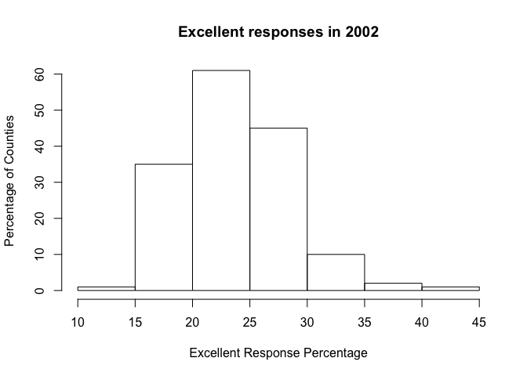

p8105\_hw2\_aar2192
================
Amadeia Rector
10/05/2018

Problem 1
=========

### **Reading** and **cleaning** the data

``` r
nyc_transit =
  read_csv(file = "./data/NYC_Transit_Subway_Entrance_And_Exit_Data.csv") %>% 
  janitor::clean_names() %>% 
  select(line, station_name:entry,vending, ada) %>% 
  mutate(entry = recode(entry,"YES" = TRUE, "NO" = FALSE))
```

    ## Parsed with column specification:
    ## cols(
    ##   .default = col_character(),
    ##   `Station Latitude` = col_double(),
    ##   `Station Longitude` = col_double(),
    ##   Route8 = col_integer(),
    ##   Route9 = col_integer(),
    ##   Route10 = col_integer(),
    ##   Route11 = col_integer(),
    ##   ADA = col_logical(),
    ##   `Free Crossover` = col_logical(),
    ##   `Entrance Latitude` = col_double(),
    ##   `Entrance Longitude` = col_double()
    ## )

    ## See spec(...) for full column specifications.

### Describing the Data

``` r
nyc_transit
```

    ## # A tibble: 1,868 x 19
    ##    line  station_name station_latitude station_longitu… route1 route2
    ##    <chr> <chr>                   <dbl>            <dbl> <chr>  <chr> 
    ##  1 4 Av… 25th St                  40.7            -74.0 R      <NA>  
    ##  2 4 Av… 25th St                  40.7            -74.0 R      <NA>  
    ##  3 4 Av… 36th St                  40.7            -74.0 N      R     
    ##  4 4 Av… 36th St                  40.7            -74.0 N      R     
    ##  5 4 Av… 36th St                  40.7            -74.0 N      R     
    ##  6 4 Av… 45th St                  40.6            -74.0 R      <NA>  
    ##  7 4 Av… 45th St                  40.6            -74.0 R      <NA>  
    ##  8 4 Av… 45th St                  40.6            -74.0 R      <NA>  
    ##  9 4 Av… 45th St                  40.6            -74.0 R      <NA>  
    ## 10 4 Av… 53rd St                  40.6            -74.0 R      <NA>  
    ## # ... with 1,858 more rows, and 13 more variables: route3 <chr>,
    ## #   route4 <chr>, route5 <chr>, route6 <chr>, route7 <chr>, route8 <int>,
    ## #   route9 <int>, route10 <int>, route11 <int>, entrance_type <chr>,
    ## #   entry <lgl>, vending <chr>, ada <lgl>

``` r
str(nyc_transit)
```

    ## Classes 'tbl_df', 'tbl' and 'data.frame':    1868 obs. of  19 variables:
    ##  $ line             : chr  "4 Avenue" "4 Avenue" "4 Avenue" "4 Avenue" ...
    ##  $ station_name     : chr  "25th St" "25th St" "36th St" "36th St" ...
    ##  $ station_latitude : num  40.7 40.7 40.7 40.7 40.7 ...
    ##  $ station_longitude: num  -74 -74 -74 -74 -74 ...
    ##  $ route1           : chr  "R" "R" "N" "N" ...
    ##  $ route2           : chr  NA NA "R" "R" ...
    ##  $ route3           : chr  NA NA NA NA ...
    ##  $ route4           : chr  NA NA NA NA ...
    ##  $ route5           : chr  NA NA NA NA ...
    ##  $ route6           : chr  NA NA NA NA ...
    ##  $ route7           : chr  NA NA NA NA ...
    ##  $ route8           : int  NA NA NA NA NA NA NA NA NA NA ...
    ##  $ route9           : int  NA NA NA NA NA NA NA NA NA NA ...
    ##  $ route10          : int  NA NA NA NA NA NA NA NA NA NA ...
    ##  $ route11          : int  NA NA NA NA NA NA NA NA NA NA ...
    ##  $ entrance_type    : chr  "Stair" "Stair" "Stair" "Stair" ...
    ##  $ entry            : logi  TRUE TRUE TRUE TRUE TRUE TRUE ...
    ##  $ vending          : chr  "YES" "YES" "YES" "YES" ...
    ##  $ ada              : logi  FALSE FALSE FALSE FALSE FALSE FALSE ...

The dataset contains **1868 observations** and **19 variables**: line, station\_name, station\_latitude, station\_longitude, route1, route2, route3, route4, route5, route6, route7, route8, route9, route10, route11, entrance\_type, entry, vending, ada. The variable types are **character**, **integer**, and **logical**.

The data were first cleaned removing spaces between words that were then instead turned into underscores to join words, and letters were decapitalized. Then, certain variables were retained and one variable, *entry*, was recategorized as logical. As mentioned previously, the **dimensions** of the dataset are **1,868 X 19**.

The data do ***not*** appear to be tidy as certain columns, for example route1-route11 are values rather than separate variables and thus should be regrouped in a tidier format.

### Answering questions

The following are questions regarding the nature of this dataset.

#### How many distinct stations are there?

``` r
nyc_transit %>% 
  distinct(station_name)
```

    ## # A tibble: 356 x 1
    ##    station_name            
    ##    <chr>                   
    ##  1 25th St                 
    ##  2 36th St                 
    ##  3 45th St                 
    ##  4 53rd St                 
    ##  5 59th St                 
    ##  6 77th St                 
    ##  7 86th St                 
    ##  8 95th St                 
    ##  9 9th St                  
    ## 10 Atlantic Av-Barclays Ctr
    ## # ... with 346 more rows

There are 356 unique station names.

#### How many stations are ADA compliant?

``` r
summary(nyc_transit$ada==TRUE)
```

    ##    Mode   FALSE    TRUE 
    ## logical    1400     468

There are 468 ADA compliant stations.

#### What proportion of station entrances/exits without vending allow entrance?

``` r
entry_no_vend_table = table(nyc_transit$entry, nyc_transit$vending)
prop_entry_no_vend = prop.table(entry_no_vend_table,2)
prop_entry_no_vend
```

    ##        
    ##                   NO          YES
    ##   FALSE 0.6229508197 0.0005934718
    ##   TRUE  0.3770491803 0.9994065282

The proportion of station entrances/exits without vending that allow entrance is 37.7%.

### Reformating the data

#### Making route number and route name separate variables

``` r
nyc_transit_tidy=nyc_transit %>% 
  gather(key =route_number, value =route_name, route1:route11) %>% 
  separate("route_number", into = c("remove", "route_number"), sep = 5) %>% 
  select(-"remove") %>% 
  na.omit()  
  str(nyc_transit_tidy)
```

    ## Classes 'tbl_df', 'tbl' and 'data.frame':    4270 obs. of  10 variables:
    ##  $ line             : chr  "4 Avenue" "4 Avenue" "4 Avenue" "4 Avenue" ...
    ##  $ station_name     : chr  "25th St" "25th St" "36th St" "36th St" ...
    ##  $ station_latitude : num  40.7 40.7 40.7 40.7 40.7 ...
    ##  $ station_longitude: num  -74 -74 -74 -74 -74 ...
    ##  $ entrance_type    : chr  "Stair" "Stair" "Stair" "Stair" ...
    ##  $ entry            : logi  TRUE TRUE TRUE TRUE TRUE TRUE ...
    ##  $ vending          : chr  "YES" "YES" "YES" "YES" ...
    ##  $ ada              : logi  FALSE FALSE FALSE FALSE FALSE FALSE ...
    ##  $ route_number     : chr  "1" "1" "1" "1" ...
    ##  $ route_name       : chr  "R" "R" "N" "N" ...
    ##  - attr(*, "na.action")= 'omit' Named int  1869 1870 1874 1875 1876 1877 1878 1879 1880 1881 ...
    ##   ..- attr(*, "names")= chr  "1869" "1870" "1874" "1875" ...

#### How many distinct stations serve the A train?

``` r
just_A = nyc_transit_tidy %>% 
  filter(route_name =="A") 

length(unique(just_A$station_name))
```

    ## [1] 56

There are 56 distinct stations that serve the A train.

#### How many ADA complaint stations does the A train serve?

``` r
ada_A = just_A %>%
  filter(ada == TRUE)
length(unique(ada_A$station_name))
```

    ## [1] 16

There are 16 stations that serve the A that are ADA compliant.

Problem 2
=========

### Read and clean Mr. Trash Wheel sheet

``` r
mr_trash_dataset =
  readxl::read_excel("./data/HealthyHarborWaterWheelTotals2018-7-28.xlsx",
                     sheet = "Mr. Trash Wheel", range = "A2:N338") %>% 
  janitor::clean_names() %>% 
  filter(!is.na(dumpster)) %>% 
  mutate(sports_balls = as.integer(sports_balls))
```

### Read and clean precipitation data for 2016 and 2017

#### Cleaning steps for 2016 precipitation data

``` r
precipitation_2016 =
  readxl::read_excel("./data/HealthyHarborWaterWheelTotals2018-7-28.xlsx",
                     sheet = "2016 Precipitation", range = "A2:B15") %>% 
  janitor::clean_names() %>% 
  na.omit() %>% 
  mutate(year = 2016) %>% 
  rename(total_precip = total)
```

#### Cleaning steps for 2017 precipitation data

``` r
precipitation_2017 =
  readxl::read_excel("./data/HealthyHarborWaterWheelTotals2018-7-28.xlsx",
                     sheet = "2017 Precipitation",range = "A2:B15") %>% 
  janitor::clean_names() %>% 
  na.omit() %>% 
  mutate(year = 2017) %>% 
  rename(total_precip = total)
```

#### Binding the two years of precipitation data

``` r
precipitation_2016_2017 = bind_rows(precipitation_2016, precipitation_2017) %>% 
  mutate(month = month.name[month])
```

#### Description of Mr. Trash Wheel and Precipitation datasets

``` r
str(mr_trash_dataset)
```

    ## Classes 'tbl_df', 'tbl' and 'data.frame':    285 obs. of  14 variables:
    ##  $ dumpster          : num  1 2 3 4 5 6 7 8 9 10 ...
    ##  $ month             : chr  "May" "May" "May" "May" ...
    ##  $ year              : num  2014 2014 2014 2014 2014 ...
    ##  $ date              : POSIXct, format: "2014-05-16" "2014-05-16" ...
    ##  $ weight_tons       : num  4.31 2.74 3.45 3.1 4.06 2.71 1.91 3.7 2.52 3.76 ...
    ##  $ volume_cubic_yards: num  18 13 15 15 18 13 8 16 14 18 ...
    ##  $ plastic_bottles   : num  1450 1120 2450 2380 980 1430 910 3580 2400 1340 ...
    ##  $ polystyrene       : num  1820 1030 3100 2730 870 2140 1090 4310 2790 1730 ...
    ##  $ cigarette_butts   : num  126000 91000 105000 100000 120000 90000 56000 112000 98000 130000 ...
    ##  $ glass_bottles     : num  72 42 50 52 72 46 32 58 49 75 ...
    ##  $ grocery_bags      : num  584 496 1080 896 368 ...
    ##  $ chip_bags         : num  1162 874 2032 1971 753 ...
    ##  $ sports_balls      : int  7 5 6 6 7 5 3 6 5 7 ...
    ##  $ homes_powered     : num  0 0 0 0 0 0 0 0 0 0 ...

There are 285 observations, or rows, and 14 variables in the Mr. Trash Wheel dataset. The variables and their correspondent type are as follows: **dumpster**, numeric; **month**, character; **year**, numeric; **date**, converted date format; **weight\_tons**, numeric; **volume\_cubic\_yards**, numeric; **plastic\_bottles**, numeric; **polystyrene**, numeric; **cigarette\_butts**, numeric; **glass\_bottles**, numeric; **grocery\_bags**, numeric;**chips\_bags**, numeric; **sports\_balls**, integer; **homes\_powered**, numeric.

The Mr. Trash Wheel data includes information from 2014 to 2018. The dumpster number corresponds to the month and year, such that a later month and year has a bigger corresponding dumpster number. Certain months have more dumpsters (more observations or rows per month), which may indicate that more trash is collected. The maximum amount of trash in tons is 5.62 and the minimum is 0.96. The variable **homes\_powered** should be positively correlated with the trash in tons, as the trash becomes incinerated and generates power. Thus the more tons, the more power.This data should relate to the joined precipitation dataset, as amount of precipitation is correlated the amount of trash collected (i.e. more rain means more trash collection). Included in the Mr. Trash Wheel dataset are the types of trash collected by Mr. Trash Wheel (the variables on the right hand side); these types are also correlated to amount of precipitation.

Thus the key variables for the mr\_trash\_dataset are most likely **weight\_tons**, **month**, **year** and **homes\_powered**; however, it may be interesting to also look at the type of weight collected and it may also depend on whether we want to count how many dumpsters are filled per month.

As for the the combined water precipitation data set, *precipitation\_2016\_2017*, there are 24 observations and 3 variables. The data only includes the data for precipitation in the years 2016-2017. The most important variables here are the **month** **year** and **total\_precip**. The data from this dataset can be used in conjunction with the Mr. Trash Wheel data to compare trash amount and precipitation during the time period within 2016-17.

The total precipitation in 2017 was **32.93**.

The median number of sports balls in a dumpster in 2016 was **26**.

Problem 3
=========

Opened BRFSS data

``` r
devtools::install_github("p8105/p8105.datasets")
```

    ## Skipping install of 'p8105.datasets' from a github remote, the SHA1 (21f5ad1c) has not changed since last install.
    ##   Use `force = TRUE` to force installation

``` r
force = TRUE
library(p8105.datasets)
data("brfss_smart2010")
```

#### Cleaning up BRFSS data

``` r
brfss_smart2010_clean =
  brfss_smart2010 %>% 
  janitor::clean_names() %>% 
  filter(topic == "Overall Health") %>% 
  separate(locationdesc, into = c("remove", "county"), sep = " - ") %>% 
  select(-class, -topic, -question, -sample_size, -remove, -confidence_limit_low:-geo_location,
         state = locationabbr) %>% 
  spread(key = response, value = data_value) %>% 
  janitor::clean_names() %>%
  mutate(Total_excellent_very_good = excellent + very_good)
str(brfss_smart2010_clean)
```

    ## Classes 'tbl_df', 'tbl' and 'data.frame':    2125 obs. of  9 variables:
    ##  $ year                     : int  2002 2002 2002 2002 2002 2002 2002 2002 2002 2002 ...
    ##  $ state                    : chr  "AK" "AL" "AR" "AZ" ...
    ##  $ county                   : chr  "Anchorage Municipality" "Jefferson County" "Pulaski County" "Maricopa County" ...
    ##  $ excellent                : num  27.9 18.5 24.1 21.6 26.6 22.7 21.2 25.5 22.2 23.4 ...
    ##  $ fair                     : num  8.6 12.1 12.5 10.3 7.5 14.3 14.4 8 11.1 11.4 ...
    ##  $ good                     : num  23.8 32.7 29.9 26.9 31.9 28.7 29 29.3 36.6 26.3 ...
    ##  $ poor                     : num  5.9 5.9 4.2 4.6 3.9 4.5 4.2 2.1 3 2.4 ...
    ##  $ very_good                : num  33.7 30.9 29.3 36.6 30.1 29.8 31.2 35.2 27.1 36.6 ...
    ##  $ Total_excellent_very_good: num  61.6 49.4 53.4 58.2 56.7 52.5 52.4 60.7 49.3 60 ...

Note: There are some missing values in the column **Total\_excellent\_very\_good** as a result of missing values in either the **excellent** and/or **very\_good** columns.

### Below are some questions surrounding the BRFSS dataset:

#### How many unique locations are included in the dataset?

``` r
summary(unique(brfss_smart2010_clean$county))
```

    ##    Length     Class      Mode 
    ##       351 character character

There are 351 unique locations or counties in this dataset.

#### Is every state represented?

``` r
summary(unique(brfss_smart2010_clean$state))
```

    ##    Length     Class      Mode 
    ##        51 character character

All 50 states are represented as well as DC.

#### Which state is observed the most?

``` r
brfss_smart2010_clean$state %>%
  table() %>% 
  sort() %>% 
  names() %>% 
  tail(.,1)
```

    ## [1] "NJ"

New Jersey, NJ, is observed the most.

#### In 2002, what is the median of "Excellent" response value?

``` r
filter_2002 =
  brfss_smart2010_clean %>% 
  filter(year == 2002)
median(filter_2002$excellent, na.rm = TRUE)
```

    ## [1] 23.6

The median of the excellent response value in 2002 is 23.6.

### A histogram of "Excellent" response values in year 2002.

``` r
hist(filter_2002$excellent)
```


